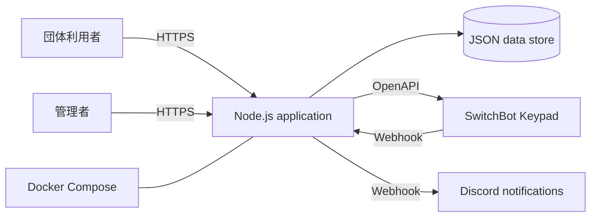

# Facility Reservation and Temporary Unlock System

大学内の学生団体向け施設予約と、SwitchBot の一時暗証番号発行を連携する Web アプリケーションです。

このリポジトリはポートフォリオ公開用に整理した版です。実運用の設定、団体情報、予約履歴、発行済み暗証番号、デバイス ID、Webhook URL、NAS の接続情報は含めていません。

## できること

- 団体アカウントの登録とログイン
- スマートフォンにも対応した施設予約申請
- 管理者による承認、却下、キャンセル
- 委員会限定の部屋など、団体ごとの施設利用権限
- SwitchBot OpenAPI を通じた期間限定暗証番号の発行と削除
- 管理者向けと団体向けに分けた Discord 通知
- 他団体が予約詳細や一時暗証番号を見られない予約所有者認可
- SwitchBot の施錠・解錠イベント履歴の記録
- Docker Compose と任意の Tailscale プロファイルによる運用

## 構成



## 技術的なポイント

### ログイン後も認可する

ログインしているだけでは予約詳細を見られません。団体は自分の予約だけを確認でき、管理者だけが全体を操作できます。委員会限定施設は、画面表示、予約作成 API、管理者承認の三段階で制限します。

### 外部サービス障害を切り分ける

SwitchBot、Discord、メールはそれぞれ別に失敗し得ます。通知が失敗しても、予約や発行済み暗証番号の状態を誤って巻き戻さないように、操作履歴とエラーを分けて扱います。

### 実運用を前提にする

モバイル表示、監査履歴、Docker 運用、権限やキャンセル表示に関する回帰テストを実装しています。実際の運用で見つかった課題をもとに、予約の見え方やアクセス制御を改善しました。

## ローカルデモ

初期設定ではモックモードで動作し、実機に一時暗証番号を発行しません。

```bash
cp .env.example .env
npm test
npm run dev
```

`http://localhost:8787` を開いてください。初回起動時にはサンプルの部屋を含む `data/db.json` が作られます。このファイルは実行時データを含むため Git 管理しません。

## 実機連携について

実機に接続する場合は、ローカルの `.env` に SwitchBot の認証情報を設定し、`SWITCHBOT_MOCK=false` にします。各部屋には Lock 本体ではなく、一時暗証番号を扱う Keypad 系デバイスの ID を設定します。これらの値は絶対にコミットしません。

本番運用では、別途認証強化、監視、バックアップ、権限レビュー、個人情報保護の方針を用意する必要があります。

## セキュリティ上の注意

- `.env`、`data/`、バックアップ、ログ、Tailscale の状態ファイルを公開しない
- 実際のデバイス ID、暗証番号、団体名、連絡先、予約履歴、IP アドレス、公開 URL、Webhook URL を公開しない
- 管理者トークンと SwitchBot の認証情報は秘密情報として扱う
- 公開前に Git の履歴全体を確認する。最新ファイルから消しただけでは、過去コミットに残った秘密情報は消えません

## テスト

```bash
npm test
```

日付処理、パスワードハッシュ、予約競合、施設利用権限、予約の所有者認可、キャンセル表示、Discord 通知の分離、一時暗証番号、SwitchBot イベントを対象にテストしています。

## ポートフォリオとしての位置付け

実際の業務課題を起点に、要件整理、Web アプリ開発、認可設計、IoT API 連携、Docker 運用、ドキュメント化、セキュリティを意識した回帰テストまでを一貫して扱ったプロジェクトです。

開発・調査の一部では AI 支援を利用しています。要件、運用判断、連携設定、検証、実際の利用を受けた改善はプロジェクトの担当者が主導しました。

## 現在の範囲と今後

このシステムは特定の運用に合わせた MVP であり、商用の多組織向け入退室管理製品ではありません。より大きな運用では、JSON ストアから管理型データベースへの移行、個別管理者アカウント、CSRF 対策、Webhook 署名検証、監視、復旧訓練、高可用性設計を追加します。
